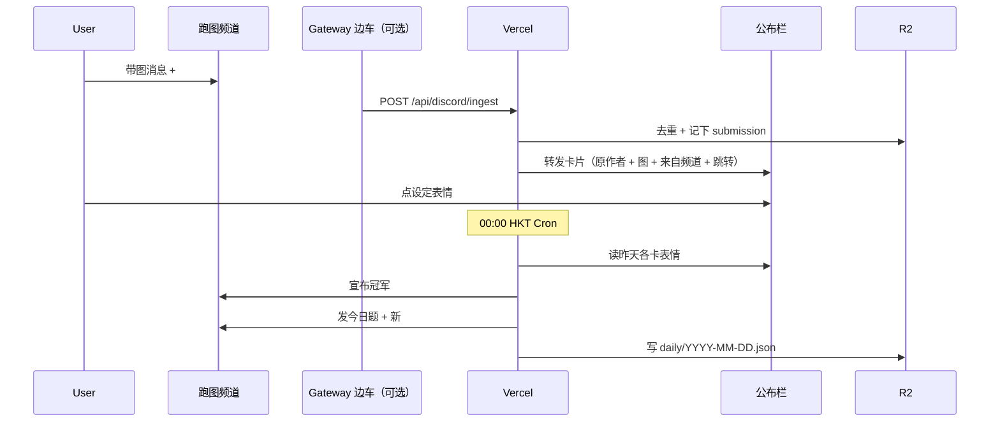

# Discord Bot 计划：`/灵感` 与 `/每日`

状态：**已拍板**。边车先上 **Railway**（$1 Free 可试，不够再升 Hobby $5）。尚未联调。  
范围：`/灵感`、`/每日`、带 `#代码` 的图转发到公布栏、0 点结算。接龙 / Activity 不做。

---

## 1. 已拍板

| 项 | 决定 |
| --- | --- |
| 托管 | **Vercel**（slash + 结算）。转发监听见 §3.3 |
| 时区 | `Asia/Hong_Kong`，**0 点发新题并结算昨天** |
| `/灵感` | **默认公开** |
| 计票 | **只用一个表情**，管理员可改（R2 / 环境变量） |
| 公布栏 | **不是只贴冠军**。监听「含当天 `#代码` 且带图」的消息，**随到随转发**到公布栏（卡片样式见图） |
| 出图 | 玩家自己画 / 抽卡姬，bot 不连 Comfy |

截图对应的公布栏卡片（已再精简）：

- **原作者**
- **图**
- 底栏：**来自 #频道**
- 按钮：**跳转原消息**

不要配文/提示词、不要 SFW/NSFW、不要删除。计票数的是公布栏上这条转发的指定表情。

---

## 2. 现有资产

```
/api/lexicon + defaultEnabled（R2）   全服词库
管理页                                 改默认启用
pickRandomSelected / composePrompt     抽卡
Discord OAuth + ADMIN_*                同一应用加 Bot 即可
```

网页 `localStorage` 勾选 **bot 不用**。每日题用服务器 `lexicon/default-enabled.json`。

---

## 3. 托管（Vercel 为主，监听要补一刀）

Slash 和 0 点 Cron **可以全在 Vercel**。  
但「有人在频道发了带 `#代码` 的图 → 马上出现在公布栏」是 **MESSAGE_CREATE**，Discord **不会** POST 到 Vercel。

所以拆两层：

```
Vercel（主）
  /api/discord/interactions    /灵感 /每日 跳转用链接（无需 NSFW/删除）
  /api/cron/daily              00:00 HKT 结算昨天 + 发今天
  /api/discord/ingest          内部接口：收到一条候选消息 → 写公布栏

监听（二选一，见下）
  只负责：新消息含今日 #代码 且带图 → POST ingest
```

### 3.1 Slash / 结算：Vercel HTTP Interactions

和网站同仓。先 `DEFERRED` 再查词库，避开 3 秒超时。  
0 点一条 Cron：先结算昨天，再发今天（Hobby 一天一次也够）。

### 3.2 不另开完整 discord.js 主机

不需要语音、不需要全 intent 的大 bot。

### 3.3 转发监听：不要扫全服

「所有输入当天 `#代码` 的带图消息」= **在指定跑图频道里**扫，不是每一个频道。全服扫要 Message Content Intent、费、还容易误伤。

配置：`DISCORD_WATCH_CHANNEL_IDS`（一个或多个，例如 `#跑图交流`）。

监听实现，选一个：

| 方案 | 延迟 | 费用 | 说明 |
| --- | --- | --- | --- |
| **A. 投稿频道 + `/投稿` 指令**（图当附件） | 立即 | 仅 Vercel | 最省事，但用户不能随手在频道贴图 |
| **B. 每 1–2 分钟 REST 拉指定频道** | 1–2 分钟 | 要 Vercel **Pro** Cron | 仍无常驻进程 |
| **C. Railway Gateway 边车**（已选） | 立即 | Free $1 可试 / Hobby $5 | 和截图一样实时。指令仍在 Vercel |

**推荐默认：C（小边车）+ Vercel。** 和截图那种「来自 #跑图交流」实时转发一致；指令和词库仍在 Vercel。  
若你暂时不想开第二台机器：先做 **A**，公布栏按钮和结算照常，贴图改成 `/投稿`。

边车职责（~100 行，无 discord.js 也行）：

1. Gateway 连上，只开 `GUILD_MESSAGES` + Message Content Intent  
2. `channelId ∈ WATCH` 且有图且正文含今日 `#OC-xxxxxx`  
3. `POST /api/discord/ingest`（带 `CRON_SECRET`）  
4. Vercel 去重（同一 `message.id` 只转一次）、发公布栏卡片

---

## 4. 产品规格

### 4.1 `/灵感`（公开）

读默认启用词库 → 每区随机 → Embed：

```
灵感  #OC-A7K2Q9
发型  双马尾
……

提示词
1girl, twintails, …

[ 再来一条 ]
```

再来一条换新种子。不代出图。

### 4.2 `#代码`

`OC-` + 6 位。R2 存快照 `bot/rolls/{code}.json`（启用列表 + 各项 index），避免管理员改词库后旧码对不上。

每日码当天固定一条，存在 `bot/daily/YYYY-MM-DD.json`。

### 4.3 `/每日`

| 入口 | 谁 | 做什么 |
| --- | --- | --- |
| Cron 00:00 HKT | 系统 | 结算昨天 → 发今天 |
| `/每日` | 任何人 | 重贴今天的题（含 `#代码`），不重抽 |
| `/每日 重抽` | 管理员 | 作废今日码再抽（已转发的图仍算旧码，不计今日冠军） |

今日题发到 `DISCORD_DAILY_CHANNEL_ID`（可以和跑图频道同一，也可以只是发题用）。

```
今日主题角色  2026-08-25
#OC-当日码

（中文摘要 + 提示词）

投稿
把图发到指定跑图频道，正文带上这个 #代码。
Bot 会转到公布栏。给公布栏上的指定表情投票。
23:59 截止，0 点公布昨天冠军。
```

### 4.4 公布栏卡片

ingest 或 `/投稿` 之后，在 `DISCORD_BULLETIN_CHANNEL_ID` 发：

```
原作者显示名
[图片]

来自 #跑图交流
[ 跳转原消息 ]
```

- **跳转原消息**：`https://discord.com/channels/{guild}/{channel}/{message}`
- 去重：同一原消息不转第二次
- 过滤：必须 **带图** + 正文含 **当天** `#OC-…`
- 不转提示词、不做 SFW/NSFW、不提供删除按钮（管理员可在 Discord 里直接删 bot 消息）

### 4.5 结算（0 点）

1. 读昨天 `daily` 记录里所有已转发的公布栏 `messageId`  
2. 只数管理员设定的那一个 emoji（默认 ❤️，存在 R2 `bot/config.json`，可用 `/每日表情 :emoji:` 改）  
3. 每用户对一条只计 1  
4. 平票：先转到公布栏的赢；0 票则从缺  
5. 在每日频道宣布冠军并链到公布栏那条（**不再重复整张图**，除非你想再 pin）  
6. 发今天的新题

### 4.6 第一期不做

- Bot 代抽 Comfy  
- 全服所有频道监听  
- 接龙 / Activity  
- 积分榜、写入世界 lore

---

## 5. 架构



代码落点：

```
src/lib/inspire.ts
src/lib/discord/verify.ts
src/lib/discord/rest.ts
src/lib/discord/boardCard.ts      公布栏 embed + 按钮
src/app/api/discord/interactions/route.ts
src/app/api/discord/ingest/route.ts
src/app/api/cron/daily/route.ts
scripts/discord-register.ts
scripts/discord-gateway.ts        仅方案 C
```

依赖：`tweetnacl` + `fetch`。方案 C 边车另用 `ws` 连 Gateway，不引进整份 discord.js。

---

## 6. 环境变量

```
DISCORD_PUBLIC_KEY=
DISCORD_BOT_TOKEN=
DISCORD_DAILY_CHANNEL_ID=        # 发每日题
DISCORD_WATCH_CHANNEL_IDS=       # 监听投稿，逗号分隔
DISCORD_BULLETIN_CHANNEL_ID=     # 公布栏
DISCORD_DAILY_EMOJI=❤️           # 可被管理员指令覆盖
CRON_SECRET=
```

沿用：`DISCORD_CLIENT_ID` / `GUILD_ID` / `ADMIN_USER_IDS` / `ADMIN_ROLE_IDS`。

Bot 权限：发消息、嵌套链接、读历史、附加文件、加反应、读消息内容（Message Content Intent，仅指定频道用）。

---

## 7. 实施顺序

0. 控制台：同一应用开 Bot、邀请、建 `#每日` / `#跑图` / `#公布栏`（跑图和每日可合并）  
1. `/灵感` + 公开 Embed + 再来一条  
2. `/每日` 发题 + R2 日档案  
3. 公布栏卡片 + ingest 去重 + 跳转原消息  
4. 接上监听（先 A 或 C）  
5. 0 点 Cron 结算 + 新题  

完成标准：

- 频道 `/灵感` 公开出提示词和 `#代码`  
- 0 点出现今日题  
- 在跑图频道发一张图并写上今日代码 → 公布栏出现「原作者 + 图 + 来自 #频道 + 跳转」  
- 管理员能改计票表情  
- 第二天 0 点每日频道出现昨天冠军链接  

---

## 8. 风险

| 风险 | 对策 |
| --- | --- |
| 冷启动 > 3s | 先 defer |
| 无 Gateway 就无法实时转发 | 方案 A 或 C，第一期就选定 |
| 有人把代码贴到无关频道 | 只 watch 名单内频道 |
| 同一图重复转 | `message.id` 去重 |
| 无图只贴提示词 | 不转（你要求带图） |
| Hobby 不能每分钟 poll | 不要选 B，选 A 或 C |
| Message Content Intent 审核 | 说明「只读指定跑图频道里带代码的投稿」；未开通前用 `/投稿` |

---

## 9. 工时

约 **4–5 天**（含公布栏卡片和一种监听）。纯 slash 无转发约 3 天。

---

## 10. 还差你选一个监听方案

玩法已经够清楚，开工前只定这个：

- **A.** 先做 `/投稿`（图当附件）+ 公布栏卡片，全程 Vercel，无第二台机器  
- **C.** 加一个只转发的 Gateway 小进程，跑图频道里随手贴图就会进公布栏（更像截图）

建议：**先 A 把 `/灵感` `/每日` 卡片和结算跑通，紧接着 C。** 卡片组件是共用的。
